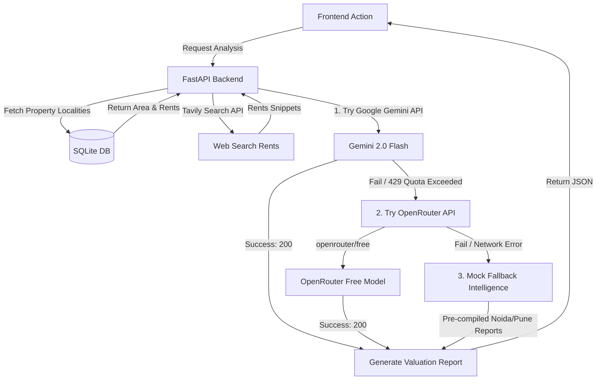

# 🏠 Property Ledger

> **A modern, mobile-first property management system for PG owners, hostel operators, landlords, and rental property managers.**

Property Ledger replaces traditional notebooks, spreadsheets, and manual registers with a powerful digital dashboard to manage **properties, tenants, rent, deposits, expenses, and occupancy**—all in one place.

This is an **owner-only management application**. It is built for simplicity, high speed, and offline-readiness.

---

## ✨ Key Features

### 🏢 Property Management
* Manage **multiple properties**
* Organize properties into **floors**, **rooms**, and **beds**
* Track occupancy in real time
* Mark rooms/beds as **Vacant**, **Reserved**, or **Occupied**

### 👥 Tenant Management
* Complete tenant profiles
* Contact & emergency information
* Document management (Aadhaar, agreements, etc.)
* Notice period tracking & vacating management

### 💰 Rent & Payment Management
* Manual rent payment recording (UPI, Cash, Bank Transfer, Cheque)
* Partial payment & outstanding rent tracking
* Rent due ledger generated dynamically per tenant per month

### 💸 Expense Tracking
* Logs utility and maintenance costs (Electricity, Water, Internet, etc.)
* Simple categories to analyze monthly outflow

### 📊 Reports & Analytics
* Occupancy reports
* Revenue vs. Expense analytics
* Outstanding rent by property
* Dynamic charts powered by Recharts

### 📋 Audit, Compliance & Tenant Portal
* **Dedicated Tenant Interface** (`/tenant-portal`): A mobile-responsive standalone tenant web application.
* **Complaints Desk**: Form for tenants to submit maintenance issues directly with status badges (**Open**, **In Progress**, **Resolved**).
* **Audit & Legal Compliance**: Track Police Verification status, KYC document proofs, and digital Lease Agreements.
* **Legal Agreement Signing**: Interactive lease agreement viewer allowing tenants to digitally sign their rent contract.
* **Tax-Compliant HRA Rent Receipts**: One-click printable rent receipt generation for tenants with automatic number-to-words currency conversion.
* **Demo Preview Selector**: Instant toggle allowing judges to test the portal from any seeded tenant's perspective.

### 🌐 Multilingual Support
* 🇬🇧 English
* 🇮🇳 Marathi

---

## 🚀 Tech Stack

### Frontend
- **Framework**: React (v18) + Vite
- **Styling**: Tailwind CSS + Radix UI + shadcn/ui
- **State Management**: TanStack React Query (v5)
- **Animations**: Framer Motion
- **Charts**: Recharts

### Backend
- **Framework**: FastAPI (Python 3)
- **Database**: SQLite (built-in, file-backed `data.db` database)
- **CORS & Static Files**: Custom FastAPI middleware to serve tenant document uploads locally
- **AI Integration**: Google Gemini API SDK + OpenRouter REST API
- **Web Search**: Tavily Search API
- **WhatsApp Automation**: Mudslide CLI (WhatsApp Web API wrapper)

---

## 🧠 AI & Automation Architecture

The platform integrates a robust multi-tiered AI and automation pipeline designed to be highly responsive, reliable, and cost-effective:



### 1. Automated Smart WhatsApp Reminders
*   **Gemini Message Personalization**: When triggering rent reminders, Gemini 2.0 Flash automatically drafts a polite, professional, and emoji-rich message tailored to the tenant's outstanding balance, joining date, and name.
*   **Mudslide Automation Subprocess**: The backend runs `npx mudslide` via subprocess to link and push messages directly to WhatsApp Web.
*   **Dual API Key Fallback**: If the primary Gemini key is blocked or limited, it forwards the prompt to OpenRouter, falling back to a static friendly text reminder if both APIs are down.

### 2. AI Market Insights & Rent Valuation
*   **Tavily Search Integration**: The app retrieves the city/address of properties and makes a target search call to the Tavily API to fetch active hostel, PG, and co-living rent listings in that specific neighborhood.
*   **AI Valuation Comparison**: Gemini compares the property's default rents against these web search results to evaluate if the rooms are underpriced, overpriced, or competitive. It outputs actionable suggestions (amenity add-ons, price increases).
*   **Cascaded Fault Tolerance**: The system automatically cascades through:
    1.  **Google AI Studio (Gemini 2.0 Flash)**
    2.  **OpenRouter (`openrouter/free` router)**
    3.  **Local Fallback Intelligence** (serving contextually accurate Noida & Pune reports to prevent any live demo failure).

---

## 🏗️ Project Structure

```text
├── backend/
│   ├── main.py              # FastAPI app, CORS configuration, CRUD routes
│   ├── db.py                # sqlite3 helper & context manager for DB connections
│   ├── schema.sql           # Database tables structure definition
│   ├── uploads/             # Directory containing uploaded tenant documents
│   └── requirements.txt     # Python requirements (FastAPI, Uvicorn)
│
└── src/
    ├── pages/               # Route-level pages
    ├── components/          # Features & shared components
    │   └── ui/              # Radix UI primitives & tailwind components
    ├── hooks/               # Custom React hooks (e.g. pull-to-refresh)
    ├── lib/                 # Localization (i18n), query client & utilities
    └── api/
        └── client.js        # Axios-like Fetch wrapper pointing to local backend
```

---

## 🗂️ Core Data Model

The application is built around the following SQL tables:

* 🏢 `properties`
* 🏬 `floors`
* 🚪 `rooms`
* 🛏️ `beds`
* 👤 `tenants`
* 💳 `payments`
* 🔐 `deposits`
* 📅 `rent_dues`
* 💸 `expenses`
* 📂 `tenant_documents`
* 📝 `notes`

### Property Hierarchy

```text
Property
└── Floor
    └── Room
        └── Bed
            └── Tenant
```

---

## 🚦 Quick Start & Setup

### 1. Configure local Environment Variables
Create a file named `.env` in the `backend/` directory:
```bash
touch backend/.env
```
Inside `backend/.env`, configure your API keys:
```env
GEMINI_API_KEY=your_gemini_api_key
TAVILY_API_KEY=your_tavily_search_api_key
OPENROUTER_API_KEY=your_openrouter_api_key
```
*(This file is ignored by `.gitignore` so your private API keys are never pushed to public Git repositories).*

### 2. Set Up WhatsApp Automation (Mudslide)
Property Ledger uses **Mudslide** (a lightweight terminal CLI built on the Baileys library) to link your WhatsApp account for automated messages.
1. Run the login command in your terminal:
   ```bash
   npx mudslide login
   ```
2. A QR code will display in the console. Open **WhatsApp** on your phone -> Go to **Linked Devices** -> **Link a Device** and scan the code.
3. Once linked, you can send automated messages directly from the app interface without human intervention.

### 3. Run the Backend (Python)
Ensure Python 3 is installed.

```bash
cd backend
python3 -m venv venv
source venv/bin/activate
pip install -r requirements.txt
python main.py
```
*The FastAPI backend will start on **`http://localhost:8000`**. You can view the interactive Swagger docs at `http://localhost:8000/docs`.*

### 4. Run the Frontend (Vite/React)
Make sure Node.js is installed.

```bash
# In the root project folder
npm install
npm run dev
```
*The React client will start on **`http://localhost:5173`**.*
